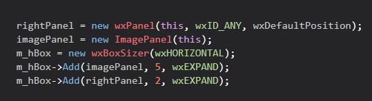

# wxImagePanel
A feature rich image panel component for the WxWidgets library. I created this due to the lack of existence of such a defualt image panel in wxWidgets. I'm hoping it helps anyone who may have such image viewever needs. Feel free to use in any of your wxWidgets projects and build upon it!

# Features
- Automatically scales the loaded image to the correct aspect ratio. 
- Built in fast panning and zooming support. 
- Capable of loading images in various formats (bitmap, file, raw data etc.).
- Built in loading screen when loading an image (turned off by default).

**DEPENDENCY NOTE: Some of the loading functions require the stb_image.h file. If you have no intentions of using those functions, you may remove the stb header file completely.**

## Usage
Simply include the imagePanel header file in your project and use the imagePanel like any other wxWidgets panel.

  Simple Example Usage:

 
How to turn on loading screen:

## A full example of it's usage can be seen <a href="https://github.com/emirsahin1/ImageBench">here</a> 
